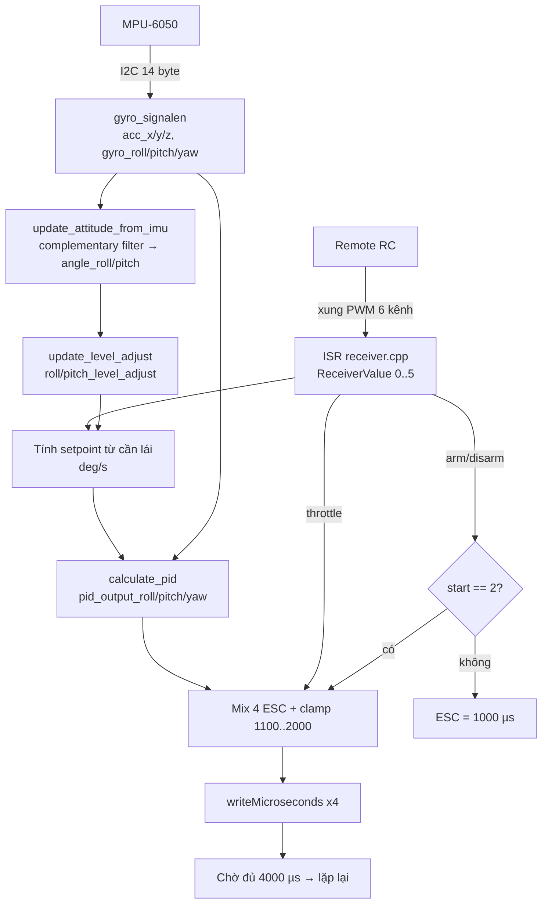

# UAV_VVD — Flight Controller cho Quadcopter trên ESP32-S3

Tài liệu này dành cho **học viên lần đầu đọc code**. Mục tiêu: sau khi đọc xong bạn hiểu được
(1) firmware này làm gì, (2) dữ liệu chạy qua những khối nào, (3) mỗi file chịu trách nhiệm gì,
(4) cách build/nạp/bay thử an toàn, (5) cách chỉnh PID và xem log.

> ⚠️ **An toàn trước tiên:** mọi thử nghiệm trên bàn **phải tháo cánh quạt**. Firmware này quay
> motor thật ngay khi arm thành công.

---

## 1. Firmware này là gì

Đây là một **flight controller (FC)** tự viết cho drone 4 cánh (quadcopter) kiểu X:

- Đọc góc/tốc độ quay từ cảm biến **MPU-6050** (gyro + accelerometer) qua I2C.
- Đọc lệnh phi công từ **remote RC** (6 kênh PWM) qua ngắt GPIO.
- Chạy **3 bộ PID** (roll / pitch / yaw) ở tần số **250 Hz** (chu kỳ 4 ms).
- Trộn (mix) output PID với throttle thành 4 xung điều khiển **ESC** (1000–2000 µs).
- Tuỳ chọn: bắn **telemetry qua WiFi UDP** về laptop để vẽ đồ thị và ghi CSV (mặc định đang tắt).

Phần cứng mục tiêu: **ESP32-S3-DevKitM-1**, framework Arduino, build bằng PlatformIO.

Code gốc thuộc dòng "YMFC" (Joop Brokking) đã được tách module và port sang ESP32-S3 — nên bạn sẽ
thấy nhiều comment tiếng Anh giữ nguyên từ bản gốc.

---

## 2. Bản đồ chân (pin map)

Tất cả đều hardcode trong code, không có file config riêng:

| Chức năng | Chân (GPIO) | Khai báo ở |
|---|---|---|
| Motor 1 (trước-phải, CCW) | 4 | `src/main.cpp:6` |
| Motor 2 (sau-phải, CW) | 5 | `src/main.cpp:7` |
| Motor 3 (sau-trái, CCW) | 6 | `src/main.cpp:8` |
| Motor 4 (trước-trái, CW) | 7 | `src/main.cpp:9` |
| I2C SDA (MPU-6050) | 11 | `Wire.begin(11, 10)` — `src/main.cpp:94` |
| I2C SCL (MPU-6050) | 10 | `Wire.begin(11, 10)` |
| RC kênh 1–6 | 37, 38, 39, 40, 41, 42 | `src/receiver/receiver.cpp:7` |
| Serial debug | USB, **57600 baud** | `src/main.cpp:90` |

Địa chỉ I2C của MPU-6050: `0x68` (`src/mpu/mpu.cpp:11`). I2C chạy ở 400 kHz.

**Quy ước kênh RC** (suy ra từ cách `loop()` dùng mảng):

| Index | Kênh | Ý nghĩa |
|---|---|---|
| `ReceiverValue[0]` | CH1 | Roll (aileron) |
| `ReceiverValue[1]` | CH2 | Pitch (elevator) |
| `ReceiverValue[2]` | CH3 | Throttle |
| `ReceiverValue[3]` | CH4 | Yaw (rudder) |
| `ReceiverValue[4..5]` | CH5/CH6 | AUX — đọc được nhưng code hiện **chưa dùng** |

> 🔎 **Điểm dễ vấp:** trong `setup()` có `digitalWrite(4, !digitalRead(4))` dùng để nháy "LED"
> trong lúc chờ 5 giây — nhưng GPIO 4 chính là chân **Motor 1**. Đoạn này chạy *trước*
> `motors_init()` nên chưa ảnh hưởng ESC, nhưng khi đọc code đừng nhầm đó là một LED riêng.

---

## 3. Cấu trúc thư mục

```
UAV_VVD/
├── platformio.ini              # board, framework, PIN VERSION platform (đọc mục 7!)
├── CLAUDE.md                   # rule nội bộ: KHÔNG sửa code, chỉ chỉnh version platform
├── include/
│   └── common.h                # header chung: chỉ include <Arduino.h> + <Wire.h>
├── src/
│   ├── main.cpp                # ⭐ vòng lặp bay: đọc IMU → ước lượng góc → PID → mix → ESC
│   ├── mpu/                    # driver MPU-6050 (setup, đọc raw, hiệu chuẩn gyro)
│   ├── pid/                    # 3 bộ PID rate + toàn bộ tham số gain
│   ├── receiver/               # bắt xung PWM 6 kênh bằng ngắt GPIO
│   ├── wifi_log/               # telemetry UDP broadcast (ĐANG TẮT — mục 6)
│   ├── debug/, dbg/            # ⚠️ file rác, xem mục 8
│   ├── wifi_log.cpp/.h         # ⚠️ bản telemetry CŨ (WebServer), xem mục 8
│   ├── index.html              # ⚠️ dashboard CŨ, xem mục 8
│   └── ground_station/         # server Node.js chạy trên laptop (mục 6)
│       ├── server.js           # UDP → CSV + WebSocket
│       ├── package.json
│       └── public/index.html   # dashboard vẽ đồ thị realtime
├── docs/flight_flow.mmd / .png # sơ đồ luồng bay
├── test/                       # sketch thử nghiệm rời, KHÔNG thuộc firmware (mục 8)
├── server.js                   # shim: require('./src/ground_station/server.js')
└── run-ground-station.cmd      # chạy nhanh ground station trên Windows
```

**Quy ước module:** mỗi module là một cặp `.cpp` + `.h` trong thư mục con của `src/`. Header chỉ
`extern` các biến toàn cục và khai báo hàm; `.cpp` là nơi **định nghĩa thật** các biến đó. Toàn bộ
firmware giao tiếp với nhau **qua biến toàn cục**, không qua struct/tham số — đây là style của code
gốc, cần nắm để không đi tìm "hàm truyền dữ liệu" mà không có.

---

## 4. Luồng dữ liệu — đọc theo thứ tự này



Sơ đồ tổng quát hơn có sẵn ở `docs/flight_flow.png`.

### 4.1 `setup()` — thứ tự khởi động (`src/main.cpp:88`)

1. `Serial.begin(57600)`.
2. `rx_config()` — gắn ngắt cho 6 chân RC. **Gọi sớm** để lúc kiểm tra ở bước 6 đã có dữ liệu.
3. `Wire.setClock(400000)` + `Wire.begin(11, 10)`; ping MPU-6050 — **kẹt vòng lặp vô hạn** nếu
   không thấy cảm biến (`error = 2`).
4. `gyro_setup()` — ghi 4 thanh ghi cấu hình cảm biến.
5. Chờ ~5 giây (1250 × 4 ms) nếu không dùng hiệu chuẩn thủ công, rồi `calibrate_gyro()`.
6. Chờ remote: mọi kênh phải > 990 µs (`error = 3`: chưa bật remote / mất sóng), rồi throttle phải
   nằm trong 990–1050 µs (`error = 4`: cần hạ ga hết cỡ).
7. `motors_init()` — cấp timer PWM, đặt 200 Hz, attach 4 chân, xuất 1000 µs và `delay(2000)` để
   ESC nhận tín hiệu arm.
8. Ghi mốc `loop_timer = micros()`.

> Biến `error` chỉ được **gán** chứ chưa được dùng để bật LED (hàm `error_signal()` đã bị comment).
> Khi debug, cách nhanh nhất là bỏ comment các `Serial.print` ở đầu `loop()`.

### 4.2 `loop()` — một chu kỳ 4 ms (`src/main.cpp:139`)

| Bước | Hàm / đoạn code | Việc |
|---|---|---|
| 1 | `gyro_signalen()` | Đọc 14 byte raw từ MPU, trừ offset hiệu chuẩn |
| 2 | `update_attitude_from_imu()` | Lọc gyro + tích phân góc + bù trôi bằng accelerometer |
| 3 | `update_level_adjust()` | Quy góc nghiêng thành lượng bù (chỉ khi `auto_level`) |
| 4 | Khối `start` | Máy trạng thái arm/disarm |
| 5 | Tính `pid_*_setpoint` | Chuyển vị trí cần lái thành tốc độ quay mong muốn (deg/s) |
| 6 | `calculate_pid()` | 3 bộ PID |
| 7 | Khối mix | Cộng/trừ output PID vào throttle → `esc_1..4` |
| 8 | `writeMicroseconds()` × 4 | Xuất xung ra ESC |
| 9 | Busy-wait | Chờ đủ 4000 µs; nếu đã quá 4050 µs thì `error = 5` (loop overrun) |

**Vì sao phải đúng 250 Hz?** Hằng số tích phân góc (`0.0000611`) và hệ số lọc được tính sẵn cho chu
kỳ 4 ms. Nếu loop chậm đi, góc ước lượng sẽ sai tỉ lệ — nên bước 9 dùng busy-wait chứ không dùng
`delay()`.

---

## 5. Giải thích từng module

### 5.1 `src/receiver/` — đọc remote bằng ngắt

- 6 chân đều gắn `attachInterrupt(..., CHANGE)`: mỗi lần chân đổi mức, ISR chạy.
- Sườn lên → ghi mốc `micros()`; sườn xuống → độ rộng xung = hiệu 2 mốc.
- Chỉ nhận xung trong khoảng **900–2100 µs**; ngoài khoảng đó bị bỏ qua → nhiễu không làm drone giật.
- ISR đọc mức chân trực tiếp từ thanh ghi `GPIO.in` / `GPIO.in1` cho nhanh, và gắn `IRAM_ATTR` để
  code ISR nằm trong RAM (bắt buộc trên ESP32).
- Giá trị mặc định khi chưa có sóng: `{1500, 1500, 1000, 1500, 1000, 1000}` — cần lái ở giữa,
  throttle thấp.
- `getReceiverValues()` copy an toàn mảng ra ngoài (chặn ngắt khi copy). **Lưu ý:** `main.cpp` hiện
  đọc thẳng `ReceiverValue[]` chứ chưa dùng hàm này.

> ⚠️ **Không có failsafe.** Nếu remote mất sóng, ISR ngừng cập nhật và `ReceiverValue[]` **giữ
> nguyên giá trị cuối cùng** — drone tiếp tục bay với lệnh cũ. Đây là bài tập mở rộng rất tốt (mục 9).

### 5.2 `src/mpu/` — driver MPU-6050

`gyro_setup()` ghi 4 thanh ghi:

| Thanh ghi | Giá trị | Ý nghĩa |
|---|---|---|
| `0x6B` PWR_MGMT_1 | `0x00` | Bật cảm biến (thoát sleep) |
| `0x1B` GYRO_CONFIG | `0x08` | Thang ±500 °/s → **65.5 LSB mỗi °/s** |
| `0x1C` ACCEL_CONFIG | `0x10` | Thang ±8 g |
| `0x1A` CONFIG | `0x03` | Lọc thông thấp số ~43 Hz (giảm nhiễu rung motor) |

`gyro_signalen()` đọc liền 14 byte từ `0x3B` (acc XYZ, temp, gyro XYZ), **đảo trục** pitch và yaw
cho khớp hướng lắp, rồi trừ các giá trị hiệu chuẩn.

`calibrate_gyro()` lấy trung bình **2000 mẫu** (drone phải nằm yên!) để tìm offset gyro. Nếu đặt
`use_manual_calibration = true` thì bỏ qua bước này và dùng các giá trị hardcode trong
`src/mpu/mpu.cpp:3-9`.

**Con số 65.5 xuất hiện ở đâu:** `main.cpp` chia raw gyro cho 65.5 để ra °/s. Nếu bạn đổi
GYRO_CONFIG sang thang khác, phải đổi cả hằng số này và hằng số `0.0000611`.

### 5.3 `update_attitude_from_imu()` — bộ lọc bù (complementary filter)

Đây là phần "toán" quan trọng nhất, nằm ngay trong `main.cpp:23`:

1. **Lọc thông thấp gyro:** `input = input*0.7 + (raw/65.5)*0.3` — làm mượt đầu vào PID.
2. **Tích phân góc:** `angle += gyro * 0.0000611`, với `0.0000611 = 1 / (250 Hz × 65.5)`.
3. **Chuyển trục khi yaw:** khi drone xoay quanh trục đứng, một phần góc roll "biến thành" pitch và
   ngược lại — hai dòng `sin(gyro_yaw * 0.000001066)` xử lý việc này
   (`0.000001066 = 0.0000611 × π/180`).
4. **Góc từ accelerometer:** `asin(acc / |acc|) × 57.296` (57.296 = 180/π). Có kiểm tra `abs()`
   trước để `asin` không ra NaN.
5. **Trộn:** `angle = angle*0.9996 + angle_acc*0.0004`.

Ý tưởng: **gyro chính xác trong ngắn hạn nhưng trôi dần**, **accelerometer ổn định dài hạn nhưng
nhiễu khi rung**. Trộn 99.96% / 0.04% mỗi chu kỳ → lấy được ưu điểm cả hai.

### 5.4 Từ cần lái tới setpoint

```cpp
pid_roll_setpoint = 0;
if (ReceiverValue[0] > 1508) pid_roll_setpoint = ReceiverValue[0] - 1508;
else if (ReceiverValue[0] < 1492) pid_roll_setpoint = ReceiverValue[0] - 1492;
pid_roll_setpoint -= roll_level_adjust;
pid_roll_setpoint /= 3.0;
```

- **Vùng chết 1492–1508 µs:** cần lái rung nhẹ quanh giữa sẽ không tạo lệnh.
- **Chia 3.0:** giới hạn tốc độ quay tối đa ≈ (2000−1508)/3 ≈ **164 °/s**. Muốn drone phản ứng
  "hiền" hơn thì tăng số chia.
- **`roll_level_adjust`** = `angle_roll × 15` — đây là vòng ngoài (auto-level): drone đang nghiêng
  bao nhiêu độ thì tự sinh lệnh quay ngược lại để về ngang. Đặt `auto_level = false`
  (`src/main.cpp:16`) sẽ thành chế độ **acro** (chỉ điều khiển tốc độ quay, không tự cân bằng).
- Pitch có dấu trừ (`-(ReceiverValue[1] - 1508)`) vì hướng cần lái ngược với quy ước trục.
- Yaw chỉ có hiệu lực khi throttle > 1050 — để lúc tắt motor gạt yaw không làm drone xoay.

### 5.5 `src/pid/` — 3 bộ PID rate

PID chạy trên **tốc độ quay** (deg/s), không phải trên góc:

```
error  = gyro_input − setpoint
I     += Ki × error              (kẹp trong ±200)
output = Kp×error + I + Kd×(error − error_trước)   (kẹp trong ±400)
```

Gain hiện tại (`src/pid/pid.cpp:23`):

| Trục | Kp | Ki | Kd | Giới hạn output |
|---|---|---|---|---|
| Roll | 1.3 | 0.04 | 15.0 | ±400 |
| Pitch | = Roll | = Roll | = Roll | ±400 |
| Yaw | 2.0 | 0.02 | 0.05 | ±400 |

Vì sao phải kẹp I (`pid_i_max = 200`): chống **integral windup** — khi drone bị giữ tay hoặc chưa
cất cánh, sai số tích luỹ mãi sẽ khiến drone giật mạnh ngay khi thả.

Khi arm (`start` chuyển 1 → 2), toàn bộ `pid_i_mem_*` và `pid_last_*_d_error` được **reset về 0**
để cất cánh không bị giật ("bumpless start").

### 5.6 Máy trạng thái arm/disarm

| Trạng thái | Điều kiện chuyển | Ý nghĩa |
|---|---|---|
| `start = 0` | mặc định | Motor tắt, ESC giữ 1000 µs |
| `start = 1` | throttle < 1050 **và** yaw < 1300 | Ga thấp + gạt yaw hết sang trái |
| `start = 2` | đang ở 1, throttle < 1050, yaw > 1450 | Trả yaw về giữa → **ARM, motor quay** |
| về `start = 0` | đang ở 2, throttle < 1050, yaw > 1700 | Ga thấp + gạt yaw hết sang phải → DISARM |

Đây là thao tác an toàn kinh điển: chỉ arm được khi ga đã ở mức thấp nhất.

### 5.7 Mixer — trộn ra 4 ESC

Cấu hình X, nhìn từ trên xuống:

```
      trước
  M4        M1        M1: trước-phải (CCW)
    \      /          M2: sau-phải   (CW)
      \  /            M3: sau-trái   (CCW)
      /  \            M4: trước-trái (CW)
    /      \
  M3        M2
      sau
```

```cpp
esc_1 = throttle − pitch + roll − yaw;   // trước-phải
esc_2 = throttle + pitch + roll + yaw;   // sau-phải
esc_3 = throttle + pitch − roll − yaw;   // sau-trái
esc_4 = throttle − pitch − roll + yaw;   // trước-trái
```

Đọc theo cột: muốn **ngóc mũi lên** thì 2 motor sau mạnh hơn 2 motor trước; muốn **xoay trái** thì
2 motor quay cùng chiều CCW mạnh hơn (phản lực xoắn).

Giới hạn:
- `throttle` bị kẹp tối đa **1800** — chừa 200 µs "dự trữ" để PID vẫn điều khiển được ở ga cao.
- Mỗi ESC kẹp trong **1100–2000 µs**; sàn 1100 giữ motor luôn quay khi đang bay (motor tắt giữa
  chừng thì mất điều khiển hoàn toàn).
- Khi `start != 2`: tất cả = 1000 µs (motor dừng hẳn).

---

## 6. Telemetry & Ground Station (tuỳ chọn)

### 6.1 Trạng thái hiện tại: **ĐANG TẮT**

Hai lý do, phải sửa cả hai mới dùng được:

1. `src/wifi_log/wifi_log.h:11` đang đặt `#define WIFI_LOG_ENABLED 0` → toàn bộ hàm biên dịch thành
   rỗng.
2. `src/main.cpp` **không include** `wifi_log.h` và không gọi `wifi_log_init()` / `wifi_log_push()`.

Để bật, cần: đổi macro thành `1`, include header, gọi `wifi_log_init()` trong `setup()` (**sau**
`motors_init()`), và gọi `wifi_log_push(pkt)` trong `loop()` sau `calculate_pid()`.

> Theo `CLAUDE.md`, repo này có rule "không sửa code" — nếu bạn muốn bật telemetry để học, hãy làm
> trên nhánh riêng của mình.

### 6.2 Phía drone hoạt động thế nào

- Một **FreeRTOS task riêng** ghim vào **Core 0** (`xTaskCreatePinnedToCore`, stack 4096, priority 1)
  — Core 1 để nguyên cho vòng lặp bay, tránh WiFi làm loop overrun.
- ESP32 phát **WiFi AP**: SSID `Drone_Log`, mật khẩu `12345678`.
- Task bắn **UDP broadcast** tới `x.x.x.255:1234`, tần suất **50 Hz** (20 ms/gói).
- Cơ chế bàn giao dữ liệu: chỉ giữ **mẫu mới nhất** (`s_latest_pkt`) trong `portENTER_CRITICAL`,
  không dùng queue → nếu WiFi chậm thì bỏ mẫu cũ chứ **không bao giờ chặn vòng lặp bay**. Đây là
  điểm thiết kế quan trọng cần hiểu: vòng lặp bay không được phép chờ mạng.

Nội dung gói tin (`struct LogPacket`, `src/wifi_log/wifi_log.h:19`): timestamp, pitch/roll/yaw_rate,
3 setpoint, 9 gain PID, 3 output PID, và mã lỗi `err` (5 = loop overrun).

### 6.3 Phía laptop

```powershell
cd src\ground_station
npm install          # chỉ cần lần đầu (dependency: ws)
node server.js       # hoặc chạy run-ground-station.cmd ở thư mục gốc
```

Rồi mở trình duyệt vào **http://localhost:3000**. Nhớ **nối laptop vào WiFi `Drone_Log`** trước.

`server.js` làm 3 việc: nhận UDP cổng 1234 → parse nhị phân → (a) ghi CSV vào
`src/ground_station/logs/flight_<timestamp>.csv`, (b) đẩy JSON qua WebSocket cho browser, (c) serve
`public/index.html`.

Dashboard vẽ 3 đồ thị realtime (pitch / roll / yaw rate), hiện 9 gain PID ở chân trang, đếm số gói,
và nháy cảnh báo **LOOP OVERRUN** khi `err == 5`.

> 🔎 **Hai điểm dễ vấp ở ground station:**
> - `PACKET_SIZE = 80` trong `server.js:64` phải khớp `sizeof(LogPacket)` sau khi trình biên dịch
>   chèn padding (77 byte dữ liệu → 80). Thêm/bớt field trong struct mà quên sửa số này thì server
>   báo "Packet lạ" và bỏ hết gói.
> - Các ô setpoint trên dashboard **chỉ hiển thị**, giá trị cố định `FIXED_SP = 0`, không gửi ngược
>   về drone (không có đường truyền chiều ngược).
> - Mở thẳng `public/index.html` bằng `file://` sẽ chạy **chế độ MOCK** với dữ liệu giả — tiện để
>   xem giao diện khi không có drone.
> - Server **xoá sạch log cũ mỗi lần khởi động**. Muốn giữ chuyến bay nào thì copy file CSV ra chỗ khác.

---

## 7. Build & nạp firmware

PlatformIO CLI thường không có trong PATH:

```powershell
$pio = "$env:USERPROFILE\.platformio\penv\Scripts\pio.exe"

& $pio run                      # build
& $pio run -t upload            # nạp
& $pio device monitor -b 57600  # xem Serial (đúng 57600!)
& $pio run -t clean             # dọn build cũ
```

### ⚠️ Rule quan trọng nhất của repo này

`platformio.ini` **ghim** `platform = espressif32@6.9.0`. Lý do (chép từ `CLAUDE.md`):

- `espressif32 @ 7.x` dùng **Arduino-ESP32 core 3.x**, đổi API LEDC/Servo/Serial → code này vẫn
  biên dịch nhưng **chạy sai**.
- Toàn bộ dòng `6.x` dùng **core 2.x**, tương thích.

Khi gặp lỗi build/runtime: **sửa version trong `platformio.ini`, không sửa code**. Sau khi đổi:
`pio pkg install` → `pio run -t clean` → `pio run`.

Thư viện phụ thuộc: `ESP32Servo` (xuất xung ESC) và `WebSockets` (chỉ bản telemetry cũ dùng tới).

---

## 8. File "rác"/legacy — đừng đọc nhầm

Repo còn giữ nhiều file không thuộc firmware đang chạy. Biết trước để khỏi mất thời gian:

| File | Tình trạng |
|---|---|
| `src/wifi_log.cpp` + `src/wifi_log.h` | Bản telemetry **cũ** dùng `WebServer` + HTML nhúng. Không ai gọi, nhưng **vẫn nằm trong `src/` nên vẫn bị biên dịch**. Bản đang dùng là `src/wifi_log/`. |
| `src/index.html` | Dashboard cũ đi kèm bản trên. Bản mới ở `src/ground_station/public/`. |
| `src/debug/` và `src/dbg/` | **Hai bản trùng nhau**, `.cpp` chỉ include header, header chỉ `extern` các biến **không tồn tại ở đâu cả**. Không có tác dụng gì. |
| `test/hehe.cpp`, `test/main_wf.cpp` | Sketch thử nghiệm rời (`hehe.cpp` là bài test đọc IMU + vẽ góc; `main_wf.cpp` rỗng). PlatformIO **không** build `test/` khi chạy `pio run`. |
| `_pio_run_output.txt` | Log build **cũ và đã lỗi thời** — nó là output của phiên bản `main.cpp` một-file trước khi tách module (số dòng trong log không khớp code hiện tại). Đừng dùng nó để đánh giá tình trạng build hiện nay. |

Ngoài ra: `main.cpp` viết `#include "receiver/RECEIVER.h"` (chữ hoa) trong khi file thật tên
`receiver.h`. Chạy được **chỉ vì Windows không phân biệt hoa/thường**; port sang Linux/macOS sẽ lỗi.

---

## 9. Lộ trình học & bài tập gợi ý

**Đọc code theo thứ tự này:**
1. `src/main.cpp` — `setup()` rồi `loop()`, đọc một lượt không cần hiểu hết công thức.
2. `src/receiver/receiver.cpp` — hiểu dữ liệu vào từ đâu.
3. `src/mpu/mpu.cpp` — hiểu cảm biến cho gì.
4. Quay lại `update_attitude_from_imu()` — phần toán, đọc kỹ mục 5.3.
5. `src/pid/pid.cpp` + khối mixer trong `main.cpp`.

**Thí nghiệm an toàn (tháo cánh quạt!):**
- Bỏ comment 2 dòng `Serial.print` in `angle_roll` / `angle_pitch` ở `loop()`, nghiêng drone bằng
  tay và quan sát góc.
- Đổi `auto_level = false` → cảm nhận khác biệt giữa chế độ self-level và acro (chỉ quan sát số,
  chưa bay).
- Đổi số chia `/3.0` thành `/6.0` → xem setpoint tối đa giảm còn ~82 °/s.
- Bật telemetry (mục 6.1) và ghi một phiên CSV, mở bằng Excel vẽ đồ thị so `pitch` với `pitch_sp`.

**Bài tập nâng cao:**
- **Failsafe:** phát hiện mất sóng RC (không có ISR nào chạy trong ~500 ms) → tự hạ throttle/disarm.
- **Dùng `getReceiverValues()`** thay vì đọc thẳng `ReceiverValue[]` trong `loop()`, giải thích vì
  sao đọc thẳng biến `volatile` 16-bit ở đây vẫn tạm ổn trên ESP32.
- **Dọn file legacy** ở mục 8 và xác nhận firmware vẫn build/chạy đúng.
- **Đo tải loop:** in ra `micros() - loop_timer` trước phần busy-wait để biết mỗi chu kỳ thực sự
  tốn bao nhiêu trong 4000 µs.

---

## 10. Từ điển thuật ngữ

| Thuật ngữ | Nghĩa |
|---|---|
| **ESC** | Electronic Speed Controller — mạch điều tốc, nhận xung 1000–2000 µs, quay motor |
| **Arm / Disarm** | Cho phép / khoá motor quay |
| **Rate PID** | PID điều khiển *tốc độ quay* (°/s), không phải góc |
| **Self-level / Acro** | Tự về ngang khi thả cần / chỉ giữ tốc độ quay, phi công tự cân |
| **Setpoint** | Giá trị mong muốn mà PID phải đuổi theo |
| **Windup** | Thành phần I tích luỹ quá lớn → giật mạnh khi thả |
| **Loop overrun** | Chu kỳ chạy quá 4000 µs → toán tích phân góc sai |
| **Complementary filter** | Trộn gyro (ngắn hạn) + accel (dài hạn) để ra góc |
| **ISR** | Interrupt Service Routine — hàm chạy khi có ngắt phần cứng |
| **IRAM_ATTR** | Bắt ESP32 đặt hàm vào RAM (bắt buộc cho ISR) |
